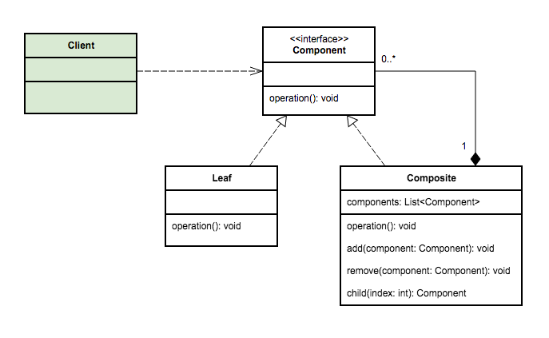

# Composite Pattern

The composite pattern says that a group of objects can be treated in the same manner as an individual object
of the group.

Composite Pattern consists of following objects:

* __Base Component__: Base component is the interface for all objects in the composition, client program uses base component to work with the objects in the composition. It can be an interface or an abstract class with some
methods common to all the objects.

* __Leaf__: Defines the behaviour for the elements in the composition. It is the building block for the composition and implements base component. It does not have references to other Components.

* __Composite__: It consists of leaf elements and implements the operations in base component.

## Examples

* Composite pattern can be used to create a tree like structure like a file system: files are leafs, folders are composites. If you delete a folder, all of its contents get deleted too (Composition relation).

* graphical program with grouping elements.

## Problems

It is not possible to define a limit of hierarchy levels. This would need to implement a level counter.

Composite pattern should be applied only when the group of objects should behave as the single object.

## Run Example

    gradle clean build run
